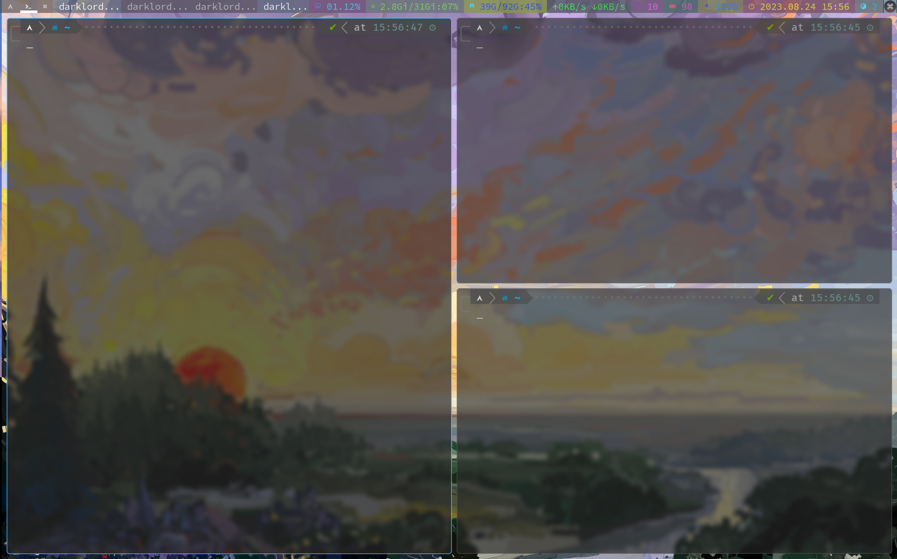
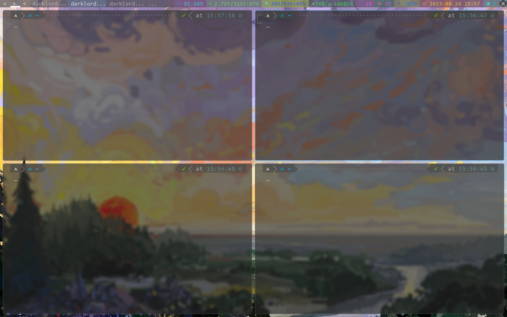

# dwm
dwm dotfiles

```
patches:
dwm-alpha-20230401-348f655.diff
dwm-autostart-20210120-cb3f58a.diff
dwm-fixborders-6.2.diff
dwm-hide_vacant_tags-6.3.diff
dwm-pertag-20200914-61bb8b2.diff
dwm-status2d-6.3.diff
dwm-systray-6.4.diff

```

```
PS:
change your autostart script path && shortcuts layouts in the config.def.h

```

Screenshots:





